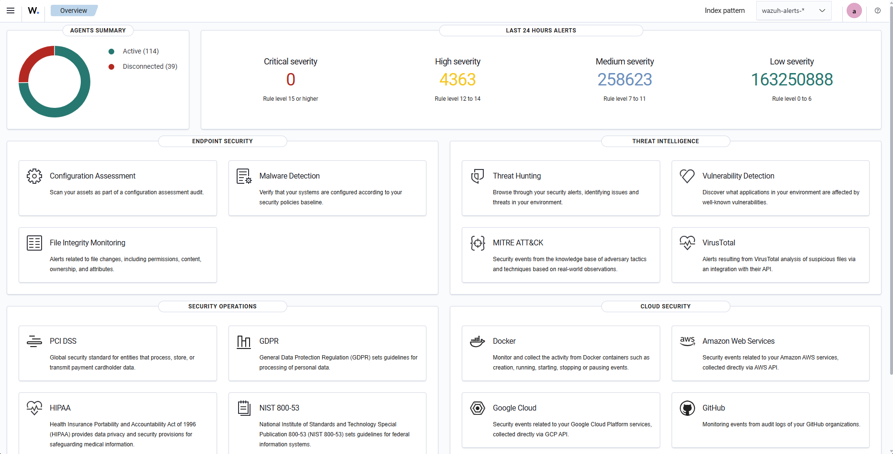

# WAZUH SIEM

## Introduction to Wazuh

Wazuh is a free and open source security platform that unifies XDR and SIEM capabilities. It protects workloads across on-premises, virtualized, containerized, and cloud-based environments.

Wazuh helps organizations and individuals to protect their data assets against security threats. It is widely used by thousands of organizations worldwide, from small businesses to large enterprises.

## Key Features and Capabilities

| **Endpoint Security** | **Threat Intelligence** | **Security Operations** | **Cloud Security** |
|----------|----------|----------|----------|
| Configuration Assessment | Threat Hunting | Incident Response | Container Security |
| Malware Detection | Log Data Analysis | Regulatory Compliance | Posture Management |
| File Integrity Monitoring | Vulnerability Detection | IT Hygiene | Workload Protection |

## How To Deploy Wazuh

  * [Single Deployment](single_deployment.md) --> for small scale 
  * [Distributed Deployment](distributed_deployment.md) --> for large scale, support horizontal scaling

## Wazuh Components

The Wazuh platform provides XDR and SIEM features to protect your cloud, container, and server workloads. These include log data analysis, intrusion and malware detection, file integrity monitoring, configuration assessment, vulnerability detection, and support for regulatory compliance.

The Wazuh solution is based on the Wazuh agent, which is deployed on the monitored endpoints, and on three central components: the Wazuh server, the Wazuh indexer, and the Wazuh dashboard.

  * `Wazuh Indexer`: highly scalable, full-text search and analytics engine. This central component indexes and stores alerts generated by the Wazuh server.
    
  * `Wazuh Server`: analyzes data received from the agents. It processes it through decoders and rules, using threat intelligence to look for well-known indicators of compromise (IOCs). A single server can analyze data from hundreds or thousands of agents, and scale horizontally when set up as a cluster. This central component is also used to manage the agents, configuring and upgrading them remotely when necessary.
    
  * `Wazuh Dashboard`: web user interface for data visualization and analysis. It includes out-of-the-box dashboards for threat hunting, regulatory compliance (e.g., PCI DSS, GDPR, CIS, HIPAA, NIST 800-53), detected vulnerable applications, file integrity monitoring data, configuration assessment results, cloud infrastructure monitoring events, and others. It is also used to manage Wazuh configuration and to monitor its status.
    
  * `Wazuh Agent`: installed on endpoints such as laptops, desktops, servers, cloud instances, or virtual machines. They provide threat prevention, detection, and response capabilities. They run on operating systems such as Linux, Windows, macOS, Solaris, AIX, and HP-UX.

## Supported Operating System

  * Amazon Linux 2, Amazon Linux 2023
  * Red Hat Enterprise Linux 7, 8, 9
  * CentOS 7, 8 **(EOL)** --> can be replace with Rocky Linux 8, 9
  * Ubuntu 16.04, 18.04, 20.04, 22.04, 24.04

## Required Port (Default)

  * **Wazuh Server** --> **TCP**: 1514,1515,1516,55000 **UDP**:514

  * **Wazuh Indexer** --> **TCP**: 9200,9300-9400

  * **Wazuh Dashboard** --> **TCP**: 443

## Copyright

  * Wazuh Copyright (C) 2015-2023 Wazuh Inc. (License GPLv2)

## Need Help To Deploy Wazuh? Reach me here

  * [Deploy Wazuh For Me](https://www.fiverr.com/packlah/install-wazuh-siem-for-you?context_referrer=tailored_homepage_perseus&source=recently_viewed_gigs&ref_ctx_id=e68c8431b0214894a1726eb5d672a5d6&context=recommendation&pckg_id=1&pos=1&context_alg=recently_viewed&seller_online=true&imp_id=55407c12-acb7-480d-9ad6-3d480322d433) 