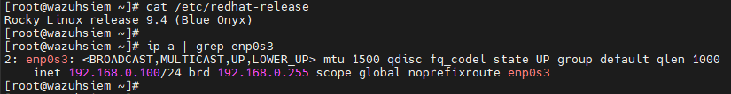
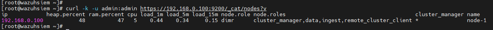
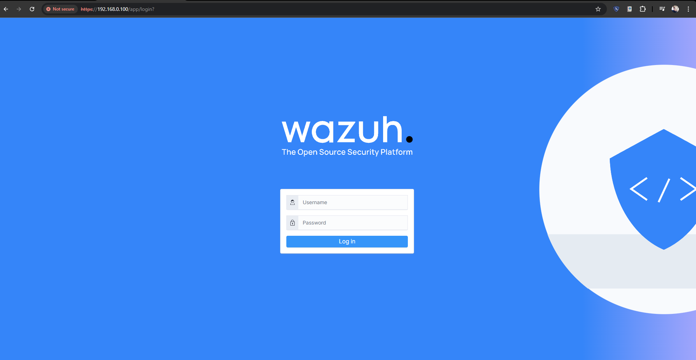

# Installing Wazuh (Distributed Deployment Guidelines)

To fully deploy Wazuh SIEM, we will need to install all the Wazuh components inside multiple server. We will distribute the components like these:

  * 3 Wazuh Indexer nodes
  * 2 Wazuh Server nodes
  * 1 Wazuh Dashboard node

We will install each components in different server, so we will need 6 servers to fully setup the Wazuh SIEM in distributed deployment.

  * [Wazuh Indexer](#install-wazuh-indexer)
  * [Wazuh Server](#install-wazuh-server)
  * [Wazuh Dashboard](#install-wazuh-dashboard)

## Prepare server for Wazuh SIEM

  * **6 Linux Server** (can be any Linux Operating System that are supported)
  * **Server IP Addresses**: 192.168.0.101 - 192.168.0.106

  

## Install Wazuh Indexer

### Create certificates for Wazuh

**Generate the SSL certificate**

1. Wazuh have provides us with the script to generate the certificate. So, we will need to download the `config.yml` configuration files together with the `wazuh-certs-tool.sh` script file.

    ```bash
    curl -sO https://packages.wazuh.com/4.9/wazuh-certs-tool.sh
    curl -sO https://packages.wazuh.com/4.9/config.yml
    ```

2. Now, we will edit the `config.yml` file. We will replace the IP address with our server IP address. Can refer the sample below:

     ```
     nodes:
        # Wazuh indexer nodes
        indexer:
            - name: node-1
              ip: "192.168.0.101"
            - name: node-2
              ip: "192.168.0.102"
            - name: node-3
              ip: "192.168.0.103"

        # Wazuh server nodes
        # If there is more than one Wazuh server
        # node, each one must have a node_type
        server:
            - name: wazuh-1
              ip: "192.168.0.104"
              node_type: master
            - name: wazuh-2
              ip: "192.168.0.105"
              node_type: worker
            #- name: wazuh-3
            #  ip: "<wazuh-manager-ip>"
            #  node_type: worker

        # Wazuh dashboard nodes
        dashboard:
            - name: dashboard
            ip: "192.168.0.106"
     ```

     *Remarks: We can replace the nodes name according to our preferences. For example, instead of naming it as `node-1`, we can replace it with `indexer-node` or something like that. Please make sure to remember the nodes name as we will need it later on.*

3. We will run the `wazuh-certs-tool.sh` script to generate the certificates.

    ```bash
    bash ./wazuh-certs-tool.sh -A
    ```

4. Compress all necessary files.

    ```bash
    tar -cvf ./wazuh-certificates.tar -C ./wazuh-certificates/ .
    rm -rf ./wazuh-certificates
    ```
5. Copy the `wazuh-certificates.tar` file to all server. Can use the `scp` utility.

    Sample on how to use:

    ```bash
    # copy the file to other server root directory
    scp wazuh-certificates.tar root@192.168.0.102:~
    ```

### Installation of Wazuh Indexer Node

**Install package dependencies**

1. Run this command to install dependencies.

    ```bash
    yum install coreutils
    ```

**Add Wazuh Repository to Download All Wazuh Packages that are needed**

1. Import the GPG key first.

    ```bash
    rpm --import https://packages.wazuh.com/key/GPG-KEY-WAZUH
    ```

2. Add Wazuh repository.

    ```bash
    echo -e '[wazuh]\ngpgcheck=1\ngpgkey=https://packages.wazuh.com/key/GPG-KEY-WAZUH\nenabled=1\nname=EL-$releasever - Wazuh\nbaseurl=https://packages.wazuh.com/4.x/yum/\nprotect=1' | tee /etc/yum.repos.d/wazuh.repo
    ```

**Installation & Configuration for Wazuh Indexer**

1. Run this command to install.

    ```bash
    yum -y install wazuh-indexer
    ```

2. We will configure the `/etc/wazuh-indexer/opensearch.yml` file to setup the wazuh indexer. We will configure on certain parts only:

    * **network.host** --> IP address of the current server
    * **node.name** --> We set it up inside the `config.yml` file previously. Use the same node names for wazuh indexer nodes.
    * **cluster.initial_master_nodes** --> List of the master-eligible indexer nodes.
    * **discovery.seed.hosts** --> List of the master-eligible IP addresses.
    * **plugins.security.nodes_dn** --> List of Distinguished Names of indexer nodes.

    *Remarks: Make sure to changes the `node-1` with the node names that we have configured.*

    Sample of configuration (for node-1 server):

    ```
    network.host: "192.168.0.100"
    node.name: "node-1"
    cluster.initial_master_nodes:
    - "node-1"
    - "node-2"
    - "node-3"
    cluster.name: "wazuh-cluster"
    discovery.seed_hosts:
      - "192.168.0.101"
      - "192.168.0.102"
      - "192.168.0.103"
    node.max_local_storage_nodes: "3"
    path.data: /var/lib/wazuh-indexer
    path.logs: /var/log/wazuh-indexer
    ```
    ```
    plugins.security.authcz.admin_dn:
    - "CN=admin,OU=Wazuh,O=Wazuh,L=California,C=US"
    plugins.security.check_snapshot_restore_write_privileges: true
    plugins.security.enable_snapshot_restore_privilege: true
    plugins.security.nodes_dn:
    - "CN=node-1,OU=Wazuh,O=Wazuh,L=California,C=US"
    - "CN=node-2,OU=Wazuh,O=Wazuh,L=California,C=US"
    - "CN=node-3,OU=Wazuh,O=Wazuh,L=California,C=US"
    ```

**Deploy the Certificate to Wazuh Indexer**

1. Run this command to set the value for the variable `NODE_NAME`. Make sure to replace the `node-1` with the node names that we have configured.

    ```bash
    NODE_NAME=node-1
    ```

2. Copy and paste this command to set up the files and directory for the certificates.

    ```bash
    mkdir /etc/wazuh-indexer/certs
    tar -xf ./wazuh-certificates.tar -C /etc/wazuh-indexer/certs/ ./$NODE_NAME.pem ./$NODE_NAME-key.pem ./admin.pem ./admin-key.pem ./root-ca.pem
    mv -n /etc/wazuh-indexer/certs/$NODE_NAME.pem /etc/wazuh-indexer/certs/indexer.pem
    mv -n /etc/wazuh-indexer/certs/$NODE_NAME-key.pem /etc/wazuh-indexer/certs/indexer-key.pem
    chmod 500 /etc/wazuh-indexer/certs
    chmod 400 /etc/wazuh-indexer/certs/*
    chown -R wazuh-indexer:wazuh-indexer /etc/wazuh-indexer/certs
    ```

**Starting the Wazuh Indexer Service**

1. Start and enable the service to run at boot time.

    ```bash
    systemctl daemon-reload
    systemctl enable --now wazuh-indexer
    ```

**Repeat All Steps Above for Other Indexer Nodes before Proceed**

**Initialize Wazuh Indexer Cluster**

1. Run this script to load new certificates information and start the cluster.

    ```bash
    /usr/share/wazuh-indexer/bin/indexer-security-init.sh
    ```
2. Testing the cluster. Change the IP address with your server IP address.

    ```bash
    curl -k -u admin:admin https://192.168.0.101:9200
    ```

    Sample Output:

    ```
    {
        "name" : "node-1",
        "cluster_name" : "wazuh-cluster",
        "cluster_uuid" : "095jEW-oRJSFKLz5wmo5PA",
        "version" : {
            "number" : "7.10.2",
            "build_type" : "rpm",
            "build_hash" : "db90a415ff2fd428b4f7b3f800a51dc229287cb4",
            "build_date" : "2023-06-03T06:24:25.112415503Z",
            "build_snapshot" : false,
            "lucene_version" : "9.6.0",
            "minimum_wire_compatibility_version" : "7.10.0",
            "minimum_index_compatibility_version" : "7.0.0"
        },
        "tagline" : "The OpenSearch Project: https://opensearch.org/"
    }
    ```
3. Run this command to check cluster working or not.

    ```bash
    curl -k -u admin:admin https://192.168.0.101:9200/_cat/nodes?v
    ```

    Sample Output:

    

## Install Wazuh Server

### Installation of Wazuh Server Node

**Adding Wazuh Repository**

1. Import GPG Key.

    ```bash
    rpm --import https://packages.wazuh.com/key/GPG-KEY-WAZUH
    ```

2. Add the repository

    ```bash
    echo -e '[wazuh]\ngpgcheck=1\ngpgkey=https://packages.wazuh.com/key/GPG-KEY-WAZUH\nenabled=1\nname=EL-$releasever - Wazuh\nbaseurl=https://packages.wazuh.com/4.x/yum/\nprotect=1' | tee /etc/yum.repos.d/wazuh.repo
    ```

**Installing the Wazuh Manager**

1. Run this command to install the wazuh manager package.

    ```bash
    yum -y install wazuh-manager
    ```

**Installing the Filebeat**

1. Run this command to install.

    ```bash
    yum -y install filebeat
    ```

**Configure the Filebeat**

1. Download the filebeat configuration file.

    ```bash
    curl -so /etc/filebeat/filebeat.yml https://packages.wazuh.com/4.9/tpl/wazuh/filebeat/filebeat.yml
    ```

2. We will edit the `/etc/filebeat/filebeat.yml` file and change the value for this:

    * **hosts** --> set it to our server IP Address

    Sample Configuration:

    ```
    output.elasticsearch:
        hosts: ["192.168.0.101:9200","192.168.0.102:9200","192.168.0.103:9200"]
        protocol: https
        username: ${username}
        password: ${password}
    ```

3. Create the filebeat keystore to securely store the authentication credentials.

    ```bash
    filebeat keystore create
    ```

4. Add default username & password `admin`:`admin` to the secrets keystore. 

    ```bash
    echo admin | filebeat keystore add username --stdin --force
    echo admin | filebeat keystore add password --stdin --force
    ```

5. Then, download the alerts template for the wazuh indexer.

    ```bash
    curl -so /etc/filebeat/wazuh-template.json https://raw.githubusercontent.com/wazuh/wazuh/v4.9.2/extensions/elasticsearch/7.x/wazuh-template.json
    chmod go+r /etc/filebeat/wazuh-template.json
    ```

6. Install the wazuh module for filebeat.

    ```bash
    curl -s https://packages.wazuh.com/4.x/filebeat/wazuh-filebeat-0.4.tar.gz | tar -xvz -C /usr/share/filebeat/module
    ```

**Deploying the Certificates for Wazuh Server**

1. Run this command to set the value for the variable `NODE_NAME`. Make sure to replace the `wazuh-1` with the node names that we have configured.

    ```bash
    NODE_NAME=wazuh-1
    ```

2. Copy and paste this command to set up the file and directory for the certificates.

    ```bash
    mkdir /etc/filebeat/certs
    tar -xf ./wazuh-certificates.tar -C /etc/filebeat/certs/ ./$NODE_NAME.pem ./$NODE_NAME-key.pem ./root-ca.pem
    mv -n /etc/filebeat/certs/$NODE_NAME.pem /etc/filebeat/certs/filebeat.pem
    mv -n /etc/filebeat/certs/$NODE_NAME-key.pem /etc/filebeat/certs/filebeat-key.pem
    chmod 500 /etc/filebeat/certs
    chmod 400 /etc/filebeat/certs/*
    chown -R root:root /etc/filebeat/certs
    ```

**Configure Connection to Wazuh Indexer**

1. Save the wazuh indexer credentials into wazuh manager keystore using the wazuh-keystore tool.

    ```bash
    echo 'admin' | /var/ossec/bin/wazuh-keystore -f indexer -k username
    echo 'admin' | /var/ossec/bin/wazuh-keystore -f indexer -k password
    ```

    *Remarks: Can change the default `admin`:`admin` with your preferred username and password. Make sure to remember it*

2. Edit the `/var/ossec/etc/ossec.conf` file to configure the connection to wazuh indexer.
   
   Find the `<indexer>` section inside the file. Change the `host` IP address to our server IP address.

    ```
    <indexer>
        <enabled>yes</enabled>
        <hosts>
            <host>https://192.168.0.101:9200</host>
            <host>https://192.168.0.102:9200</host>
            <host>https://192.168.0.103:9200</host>
        </hosts>
        <ssl>
            <certificate_authorities>
                <ca>/etc/filebeat/certs/root-ca.pem</ca>
            </certificate_authorities>
            <certificate>/etc/filebeat/certs/filebeat.pem</certificate>
            <key>/etc/filebeat/certs/filebeat-key.pem</key>
        </ssl>
    </indexer>
    ```

    *Make sure that the `filebeat.pem` and `filebeat-key.pem` are in the `/etc/filebeat/certs` directory.

**Starting the Wazuh Manager Service**

1. Start and ensure the service run the boot time.

    ```bash
    systemctl daemon-reload
    systemctl enable --now wazuh-manager
    ```

2. Check the status of wazuh manager service.

    ```bash
    systemctl status wazuh-manager
    ```

**Starting the Filebeat service**

1. Start and ensure the service run the boot time.

    ```bash
    systemctl daemon-reload
    systemctl enable --now filebeat
    ```

2. Verify that filebeat is working successfully.

    ```bash
    filebeat test output
    ```

    Sample output:

    ```
    elasticsearch: https://192.168.0.101:9200...
        parse url... OK
        connection...
            parse host... OK
            dns lookup... OK
            addresses: 192.168.0.100
            dial up... OK
        TLS...
            security: server's certificate chain verification is enabled
            handshake... OK
            TLS version: TLSv1.3
            dial up... OK
        talk to server... OK
        version: 7.10.2
    ```

**Repeat All Steps Above for Other Server Nodes before Proceed**

**Wazuh Server Cluster Setup (Master & Worker nodes)**

1. Configure master node. Edit `/var/ossec/etc/ossec.conf` on server nodes that will be the master nodes. *Only one server can be the master node.*

    ```
    <cluster>
        <name>wazuh</name>
        <node_name>master-node</node_name>
        <node_type>master</node_type>
        <key>c98b62a9b6169ac5f67dae55ae4a9088</key>
        <port>1516</port>
        <bind_addr>0.0.0.0</bind_addr>
        <nodes>
            <node>192.168.0.104</node>
        </nodes>
        <hidden>no</hidden>
        <disabled>no</disabled>
    </cluster>
    ```

*Remarks: run this command `openssl rand -hex 16` to generate random key, then insert the key inside the configuration for `<key>`.

2. Restart the service (master node).

    ```bash
    systemctl restart wazuh-manager
    ```

3. Configure the worker node. Edit `/var/ossec/etc/ossec.conf` on server nodes that will be the worker nodes.

    ```
    <cluster>
        <name>wazuh</name>
        <node_name>worker-node</node_name>
        <node_type>worker</node_type>
        <key>c98b62a9b6169ac5f67dae55ae4a9088</key>
        <port>1516</port>
        <bind_addr>0.0.0.0</bind_addr>
        <nodes>
            <node>192.168.0.104</node>
        </nodes>
        <hidden>no</hidden>
        <disabled>no</disabled>
    </cluster>
    ```

4. Restart the service (worker node)

    ```bash
    systemctl restart wazuh-manager
    ```

**Testing Wazuh Server Cluster**

    ```bash
    /var/ossec/bin/cluster_control -l
    ```

    Sample Output:

    ```
    NAME         TYPE    VERSION  ADDRESS
    master-node  master  4.9.2   192.168.0.104
    worker-node  worker  4.9.2   192.168.0.105
    ```

## Install Wazuh Dashboard

**Install the following package dependencies**

1. Run this command to install the package.

    ```bash
    yum install libcap
    ```

**Adding Wazuh Repository**

1. Import GPG Key.

    ```bash
    rpm --import https://packages.wazuh.com/key/GPG-KEY-WAZUH
    ```

2. Add the repository.

    ```bash
    echo -e '[wazuh]\ngpgcheck=1\ngpgkey=https://packages.wazuh.com/key/GPG-KEY-WAZUH\nenabled=1\nname=EL-$releasever - Wazuh\nbaseurl=https://packages.wazuh.com/4.x/yum/\nprotect=1' | tee /etc/yum.repos.d/wazuh.repo
    ```

**Installation of Wazuh Dashboard Node**

1. Install the wazuh dashboard package.

    ```bash
    yum -y install wazuh-dashboard
    ```

2. Edit the `/etc/wazuh-dashboard/opensearch_dashboards.yml` file. Replace these value:

    * **server.host** --> set to server IP address
    * **opensearch.hosts** --> set to the server IP address

    Sample configuration:

    ```
    server.host: 192.168.0.106
    server.port: 443
    opensearch.hosts: ["https://192.168.0.101:9200","https://192.168.0.102:9200","https://192.168.0.103:9200"]
    opensearch.ssl.verificationMode: certificate
    ```

**Deploying Certificate for Wazuh Dashboard**

1. Run this command to set the value for the variable `NODE_NAME`. Make sure to replace the `dashboard` with the node names that we have configured.

    ```bash
    NODE_NAME=dashboard
    ```

2. Copy and paste this command to set up the file and directory for the certificates.

    ```bash
    mkdir /etc/wazuh-dashboard/certs
    tar -xf ./wazuh-certificates.tar -C /etc/wazuh-dashboard/certs/ ./$NODE_NAME.pem ./$NODE_NAME-key.pem ./root-ca.pem
    mv -n /etc/wazuh-dashboard/certs/$NODE_NAME.pem /etc/wazuh-dashboard/certs/dashboard.pem
    mv -n /etc/wazuh-dashboard/certs/$NODE_NAME-key.pem /etc/wazuh-dashboard/certs/dashboard-key.pem
    chmod 500 /etc/wazuh-dashboard/certs
    chmod 400 /etc/wazuh-dashboard/certs/*
    chown -R wazuh-dashboard:wazuh-dashboard /etc/wazuh-dashboard/certs
    ```

**Starting the Wazuh Dashboard Service**

1. Start and ensure the service run the boot time.

    ```bash
    systemctl daemon-reload
    systemctl enable --now wazuh-dashboard
    ```

2. Edit the `/usr/share/wazuh-dashboard/data/wazuh/config/wazuh.yml` file. Replace the `url` with the server master node IP address.

    ```
    hosts:
        - default:
            url: https://192.168.0.104
            port: 55000
            username: wazuh-wui
            password: wazuh-wui
            run_as: false
    ```

### You have `SUCCESSFULLY` Install and Deploy Wazuh SIEM for Single Deployment.

**Access to your Wazuh Dashboard --> https://192.168.0.106 (your server IP address)**

